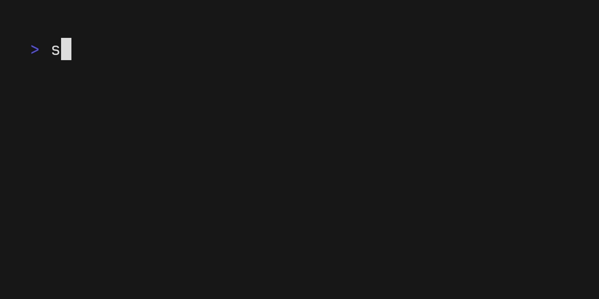

# slp

[](https://github.com/koki-develop/slp/releases/latest)
[](https://github.com/koki-develop/slp/actions/workflows/ci.yml)
[](https://codeclimate.com/github/koki-develop/slp/maintainability)
[](https://goreportcard.com/report/github.com/koki-develop/slp)
[](./LICENSE)

sleep command with rich progress bar.


- [Installation](#installation)
- [Usage](#usage)
- [LICENSE](#license)

## Installation

### Homebrew

```console
$ brew install koki-develop/tap/slp
```

### `go install`

```console
$ go install github.com/koki-develop/slp@latest
```

### Releases

Download the binary from the [releases page](https://github.com/koki-develop/slp/releases/latest).

## Usage

```console
$ slp --help
sleep command with rich progress bar.

Usage:
  slp [time] [flags]

Flags:
      --second             set the time unit to seconds (default)
      --minute             set the time unit to minutes
      --hour               set the time unit to hours
  -b, --beep               beep when finished sleeping
      --color string       color of progress bar
      --gradient strings   apply a gradient between the two colors (default [#005B72,#1DD2FF])
  -h, --help               help for slp
  -v, --version            version for slp
```

### Customize Color

`--gradient` flag can be used to apply a gradient between the two colors.

```sh
# e.g.
$ slp 3 --gradient #000000,#ffffff
```


You can also set a single color with the `-color` flag.

```sh
# e.g.
$ slp 3 --color #ff0000
```



## LICENSE

[MIT](./LICENSE)
